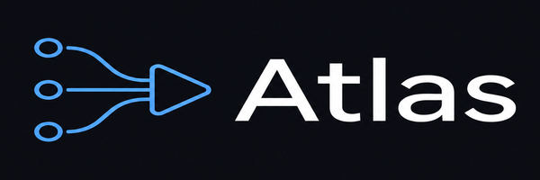

<p align="center">
  
</p>

# Beatboard — AI 媒体节点编辑器

用节点图的方式串联 AI 图像 / 视频生成工作流。基于 Tauri + React 构建的 macOS 桌面应用，使用 PixVerse CLI 在本地直接调用 AI 生成能力。

[](https://github.com/miracleagi/Beatboard/releases/latest/download/Beatboard_0.9.0_aarch64.dmg)
[](LICENSE)
[](https://github.com/miracleagi/Beatboard/releases)

---

## Mac 安装

### 第一步：安装 Beatboard

Beatboard 会自行管理所有运行依赖：ffmpeg 已内置，PixVerse CLI 与专用 Node.js 运行时
安装在 Beatboard 自己的应用数据目录中，不会修改系统环境。

**普通用户不需要终端、Homebrew、Node.js/npm、全局 PixVerse CLI，也不需要运行任何安装脚本。**

首次打开后：

1. 点击右上角 **⚙ Config**
2. 在 **Managed runtimes** 中点击 **Install PixVerse**
3. 下载完成后点击 **Sign in to PixVerse**，在浏览器完成登录

只有首次在 Beatboard 内下载 PixVerse 运行时时需要联网；之后运行时会保留在
`~/Library/Application Support/com.beatboard.app/runtime/`，升级 Beatboard.app 不会清除登录和运行时。

---

### 第二步：打开 Beatboard

安装完成后，双击 **`Beatboard.app`** 启动，或从 DMG 拖入 Applications 文件夹后打开。

> 首次打开如果系统提示"无法验证开发者"，请前往  
> **系统设置 → 隐私与安全性 → 仍要打开**

---

## 节点类型

### 输入节点
| 节点 | 说明 |
|------|------|
| **Prompt** | 文本提示词输入 |
| **Asset** | 图片 / 视频 / 音频素材（支持从本地磁盘选择，或从 Library 中选取） |

### PixVerse 生成节点
| 节点 | 说明 |
|------|------|
| **Image** | 文生图 / 图生图 |
| **Video** | 文生视频 / 图生视频 |
| **Transition** | 两张图之间的过渡视频 |
| **Reference** | 多图 / 多视频 / 多音频参考生成 |
| **Motion Control** | 用参考视频控制运动轨迹 |
| **Extend** | 延长已有视频 |
| **Upscale** | 视频超分辨率 |
| **Modify** | 用提示词和参考图修改已有视频 |
| **Voice** | 生成独立的文字转语音音频 |
| **Music** | 生成纯音乐、自动歌词或自定义歌词音乐 |
| **Template** | 按模板 ID 运行 PixVerse 模板 / 特效 |

### 工具节点
| 节点 | 说明 |
|------|------|
| **Pick** | 从多个候选结果中手动选一张 |
| **ffmpeg** | 本地视频拼接 / 剪辑 |
| **Output** | 将结果保存到本地目录 |

---

## 基本用法

1. 顶部 `+` 新建项目（支持模板）
2. 从左侧面板拖入节点到画布
3. 拖动右侧端口连接到下一个节点的左侧端口（自动类型校验）
4. 右键节点 → **Run from here** 从当前节点开始运行
5. 点击右上角 **Run** 运行整张图
6. 运行中可点击 **Stop** 中断

实线连接是必需依赖：前置节点全部产生有效结果后，下游节点才会运行。虚线连接是可选参考，不参与依赖门禁。**Run from here** 会自动补跑缺少结果的上游节点，并复用仍然有效的已有结果。

**快捷操作：**
- `Backspace / Delete` — 删除选中节点或连线
- 右键节点 — 运行 / 复制 / 删除
- 拖拽空白区域 — 平移画布
- 点击空白区域 — 取消选中

---

## 配置

点击右上角 **⚙ Config** 打开配置面板：

- **Managed runtimes**：检查内置 ffmpeg、安装/更新 Beatboard 私有 PixVerse 运行时、发起账号登录
- **Advanced runtime overrides**：仅在调试时覆盖 ffmpeg 或 PixVerse 路径
- **项目默认输出目录**：Output 节点保存文件的默认位置

---

## 接入 AI Agent(MCP)

Beatboard 运行时会在本机启动一个 [MCP](https://modelcontextprotocol.io) server,
让 AI 编程助手(Claude Code、Cursor 等)直接在画布上搭建和运行媒体管线——你可以实时看着节点图长出来。

```bash
# Claude Code
claude mcp add --transport http beatboard http://127.0.0.1:4923/mcp
```

然后对 agent 说类似 *"做一个 30 秒产品预告片的分镜:生成 4 张静帧,逐张转成动画,最后拼接成片"*——
节点图会实时出现在画布上,agent 的每一步操作都可以用 ⌘Z 撤销。

**暴露的工具:** `list_projects` · `create_project` · `switch_project` · `delete_project` · `get_graph` · `add_node` · `connect_nodes` · `set_params` · `run_node` · `get_node_result`

- Server 监听 `127.0.0.1:4923`(可用环境变量 `BEATBOARD_MCP_PORT` 修改),仅在 Beatboard 运行期间存在,不接受远程连接
- 生成节点通过 Beatboard 私有管理的 PixVerse CLI 和你的 PixVerse 账号执行，和手动点 Run 完全一致
- **Pick** 节点会暂停运行等人工挑选,agent 会被告知等待你的选择

---

## Library

运行结果可以点击节点上的 **☆ 收藏** 按钮保存到 Library。  
Library 中的素材可以跨项目复用，直接拖到画布上或在 Asset 节点的 Inspector 中选取。

---

## 项目结构

```
Beatboard.app                    ← 桌面应用（Tauri 打包）
dev.command                  ← 开发模式启动（需要 Rust 环境）
src/                         ← 前端源码（JSX，不需要编译步骤）
  shared.jsx                 ← 设计 token、图标、通用组件
  state.jsx                  ← 状态管理、节点模板、Executor 接口
  editor.jsx                 ← 画布：拖拽、连线、运行器
  editor-node.jsx            ← 单个节点组件
  editor-panels.jsx          ← 顶栏、左侧面板、右侧 Inspector
  editor-app.jsx             ← 应用根组件、自动保存
  mcp-bridge.jsx             ← MCP 操作 → 实时图状态(agent 桥)
  graph.jsx                  ← 连线路径、端口
  scenarios.jsx              ← 项目模板
src-tauri/                   ← Rust 后端
  src/main.rs                ← Tauri invoke 处理器
  src/mcp.rs                 ← MCP server(agent 驱动画布)
  src/runtime.rs             ← 内置 ffmpeg + Beatboard 私有 PixVerse 运行时管理
  src/pixverse.rs            ← PixVerse CLI 参数解析与执行
  src/ffmpeg.rs              ← ffmpeg 节点执行
  src/thumbs.rs              ← 运行结果解析与缩略图下载
  src/storage.rs             ← 项目文件持久化
  src/utils.rs               ← 工具函数
  runtime/                   ← PixVerse 固定版本 npm lock（不包含 node_modules）
web/                         ← Tauri 静态资源目录（由 src/ 自动同步）
scripts/                     ← 仅供开发者使用的可复现发布 sidecar 构建脚本
```

---

## 开发模式

本节命令仅供从源码构建 Beatboard 的开发者使用；已安装 Beatboard.app 的普通用户不需要执行。

需要先安装 [Rust](https://rustup.rs/) 工具链和 Tauri 1 CLI：

```bash
cargo install tauri-cli --version '^1' --locked
```

```bash
./dev.command
```

脚本会自动将 `src/` 同步到 `web/src/`，然后启动 `cargo tauri dev`（热重载）。

### 发布构建

```bash
./scripts/build-bundled-ffmpeg.sh
cd src-tauri
cargo tauri build
```

产物在 `src-tauri/target/release/bundle/macos/`。

发布脚本从 FFmpeg 官方 Git tag `n8.1.2` 的固定 commit 构建 LGPL-only sidecar，
禁用 GPL/nonfree 组件，优先使用 macOS VideoToolbox，并以 LGPL MPEG-4 编码器回退。每种 CPU 架构需要在对应的
Mac runner 上构建一次；生成的二进制位于 `src-tauri/binaries/`，不提交到 Git。

---

## 数据持久化

所有项目数据保存在 macOS 应用数据目录（`~/Library/Application Support/com.beatboard.app/`）。

数据格式：

```jsonc
{
  "config": { "binPaths": { "pixverse": "", "ffmpeg": "" }, ... },
  "projects": [
    {
      "id": "...", "name": "...", "color": "#...",
      "graph": { "nodes": [...], "edges": [...] },
      "runResults": { "<nodeId>": { "thumbs": [...] } },
      "outputDir": "/Users/..."
    }
  ]
}
```

顶部菜单 `+` → **Export** 可将单个项目导出为 `.beatboard.json` 文件，随时可重新导入。

> **从 Atlas（0.9.0 及更早）升级？** Beatboard 原名 Atlas，改名会改变应用数据目录。首次启动时会自动导入已保存的项目，并把托管运行时迁移过来，无需手动操作。旧名下生成的媒体文件保持原位且仍能正常预览；确认数据都迁移过来之后，可以删除旧目录 `~/Library/Application Support/com.atlas.pipeline/`。
